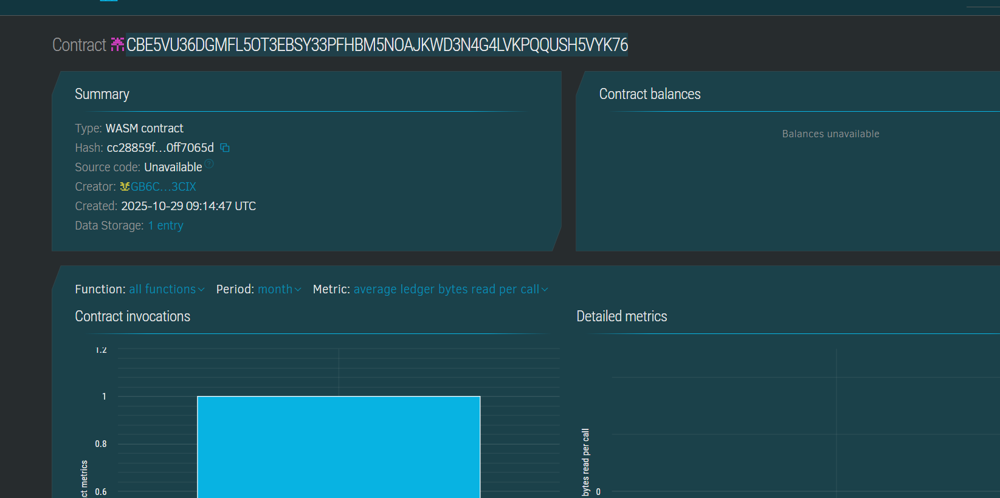

# Decentralized Blog

## Project Title
**Decentralized Blog - Censorship-Resistant Blogging Platform**

## Project Description
The Decentralized Blog is a censorship-resistant blogging platform that leverages blockchain technology and IPFS (InterPlanetary File System) for content storage. This smart contract serves as the backbone of the platform, providing an immutable index of blog posts while the actual content remains distributed on IPFS. By decentralizing content storage and using blockchain for indexing, the platform ensures that blog posts cannot be censored, altered, or removed by any central authority.

The smart contract is built using Soroban SDK on the Stellar blockchain, offering:
- **Permanent Content Storage**: Blog content is stored on IPFS with hashes recorded on-chain
- **Ownership Verification**: Authors maintain verifiable ownership of their content through blockchain addresses
- **Censorship Resistance**: No central authority can remove or modify content
- **Transparent Indexing**: All blog posts are indexed on-chain with metadata

## Project Vision
Our vision is to create a truly free and open internet where writers, journalists, and content creators can publish without fear of censorship, de-platforming, or content manipulation. In an era where centralized platforms can arbitrarily remove content, the Decentralized Blog aims to:

1. **Preserve Freedom of Expression**: Enable anyone to publish content that cannot be censored by governments, corporations, or platform administrators
2. **Ensure Content Permanence**: Guarantee that published content remains accessible indefinitely through distributed storage
3. **Empower Content Creators**: Give authors complete control over their work with cryptographically verified ownership
4. **Build Trust Through Transparency**: Provide an immutable record of all publications with verifiable timestamps and authorship
5. **Foster Global Communication**: Create a platform accessible to anyone, anywhere, regardless of geographical or political boundaries

## Key Features

### 1. **Create Blog Post**
- Authors can publish new blog posts by providing:
  - IPFS hash (where the full content is stored)
  - Title of the post
  - Author's verified blockchain address
- Each post receives a unique ID and timestamp
- Automatic tracking of author statistics

### 2. **Deactivate Blog Post**
- Authors can soft-delete their own posts
- Only the original author can deactivate their content
- Posts remain on-chain but are marked as inactive
- Provides flexibility while maintaining historical records

### 3. **Retrieve Blog Post**
- Anyone can query blog posts by their unique ID
- Returns complete post metadata including:
  - Author address
  - IPFS hash for content retrieval
  - Title and timestamp
  - Active status

### 4. **Platform Statistics**
- Real-time tracking of:
  - Total number of posts created
  - Number of active (non-deleted) posts
  - Total number of unique authors
- Provides transparency about platform growth and usage

### 5. **Ownership Verification**
- Built-in authentication ensures only authorized users can create or deactivate posts
- Cryptographic proof of authorship stored on-chain
- Prevents unauthorized modifications

### 6. **Distributed Storage**
- Content stored on IPFS for true decentralization
- Only metadata and hashes stored on-chain (efficient and cost-effective)
- Content remains accessible even if blockchain nodes go offline

## Future Scope

### Short-term Enhancements
1. **Commenting System**: Enable readers to leave comments on posts, stored similarly with IPFS
2. **Post Categories & Tags**: Implement tagging system for better content organization and discovery
3. **Author Profiles**: Create author profile pages with bio, social links, and post history
4. **Tipping Mechanism**: Allow readers to tip authors directly in cryptocurrency
5. **Content Editing**: Enable authors to update posts (with version history maintained on IPFS)

### Medium-term Developments
1. **Reputation System**: Build author reputation scores based on community engagement
2. **Content Moderation DAO**: Implement decentralized governance for flagging illegal content
3. **Search Functionality**: Develop indexing service for full-text search across all posts
4. **Rich Media Support**: Expand to support images, videos, and audio content
5. **Multi-chain Deployment**: Deploy on multiple blockchains for increased accessibility
6. **NFT Integration**: Allow authors to mint posts as NFTs for monetization

### Long-term Vision
1. **Decentralized Frontend**: Create fully decentralized UI hosted on IPFS
2. **Token Economics**: Launch platform token for governance and rewards
3. **Content Monetization**: Implement subscription models and pay-per-view articles
4. **Cross-platform Integration**: Enable publishing to multiple decentralized platforms simultaneously
5. **AI Content Verification**: Integrate tools to verify authenticity and detect deepfakes
6. **Decentralized CDN**: Build content delivery network for faster IPFS retrieval
7. **Mobile Applications**: Native mobile apps for iOS and Android
8. **Collaborative Writing**: Enable multiple authors to co-author posts
9. **Version Control**: Advanced content versioning similar to Git
10. **Integration with Decentralized Identity**: Support DID standards for author verification

### Research & Innovation
- Explore Layer 2 solutions for reduced transaction costs
- Investigate zero-knowledge proofs for private blogging
- Develop encryption options for sensitive content
- Study incentive mechanisms for IPFS node operators
- Research cross-chain bridges for wider accessibility

## Contract Details
CBYBXO7KVJIMVIP6CCH6BTZPFUPAUCASXTKKAXLNAQCZCXA4FBIKA6FX

---

**Built on Stellar using Soroban Smart Contracts**

*Empowering voices, preserving truth, ensuring freedom.*

